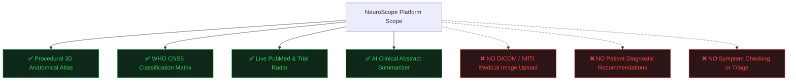
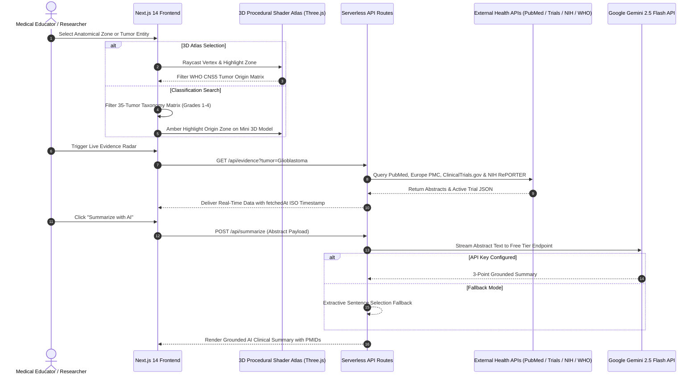

# NeuroScope — Interactive 3D WHO CNS5 Brain Tumor Atlas & Evidence Hub

<div align="center">


**An interactive 3D procedural anatomical atlas and classification platform for the 2021 WHO CNS5 Central Nervous System tumor taxonomy, powered by live biomedical literature radar and AI-grounded evidence summarization.**

[🌐 **Live Interactive Platform**](https://tumorscope.vercel.app) • [📖 **WHO CNS5 Taxonomy**](https://github.com/Vilsee/tumorscope#-%EF%B8%8F-who-cns5-taxonomy-architecture) • [📡 **Live Biomedical APIs**](https://github.com/Vilsee/tumorscope#-live-biomedical-api-integrations)

---

</div>

## 🛡️ Scope & Compliance Statement



> [!IMPORTANT]
> **HARD EXCLUSION SCOPE BOUNDARY:**
> NeuroScope is strictly an **educational anatomical atlas and classificatory reference tool**. It contains **ZERO `<input type="file">` elements** and does NOT process, upload, or analyze medical images (DICOM/MRI/CT). A persistent legal disclaimer badge (*"Educational Anatomical Atlas — Not a Diagnostic Tool"*) is anchored at `z-index: 50` on every page.

---

## 🏛️ System Architecture & Data Flow



---

## 🔬 WHO CNS5 Taxonomy Architecture

NeuroScope incorporates all 10 primary categories and 35 entity classifications defined in the 2021 5th Edition WHO Classification of Tumors of the Central Nervous System:

```
WHO CNS5 Taxonomy Matrix
├── 1. Gliomas, Glioneuronal & Neuronal Tumors
│   ├── Glioblastoma, IDH-wildtype (Grade 4)
│   ├── Astrocytoma, IDH-mutant (Grades 2–4)
│   ├── Oligodendroglioma, IDH-mutant & 1p/19q-codeleted (Grades 2–3)
│   ├── Diffuse Midline Glioma, H3 K27-altered (Grade 4)
│   ├── Pilocytic Astrocytoma (Grade 1)
│   └── Ependymoma (Grades 1–3)
├── 2. Meningiomas
│   ├── CNS WHO Grade 1 (Benign: Meningothelial, Fibrous, Transitional)
│   ├── CNS WHO Grade 2 (Atypical, Chordoid, Clear Cell)
│   └── CNS WHO Grade 3 (Anaplastic / Malignant, Rhabdoid, Papillary)
├── 3. Mesenchymal, Non-Meningothelial Tumors
│   └── Solitary Fibrous Tumor (Grades 1–3), Hemangioblastoma (Grade 1)
├── 4. Cranial & Paraspinal Nerve Tumors
│   └── Schwannoma (Grade 1), Neurofibroma (Grade 1), MPNST (Grades 3–4)
├── 5. Sellar Region Tumors
│   └── Pituitary Neuroendocrine Tumor / PitNET, Craniopharyngioma (Grade 1)
├── 6. Pineal Region Tumors
│   └── Pineocytoma (Grade 1), Pineoblastoma (Grade 4), PPTID (Grades 2–3)
├── 7. Embryonal Tumors
│   └── Medulloblastoma (WNT, SHH, Group 3, Group 4 - Grade 4), AT/RT (Grade 4)
├── 8. Germ Cell Tumors
│   └── Germinoma, Teratoma, Yolk Sac Tumor, Choriocarcinoma
├── 9. Primary CNS Lymphomas (PCNSL)
│   └── Primary Diffuse Large B-Cell Lymphoma of the CNS
└── 10. Metastatic Tumors to the CNS
    └── Brain Parenchymal Metastases, Leptomeningeal Carcinomatosis
```

---

## 📊 WHO Grade & Malignancy Spectrum (`TumorSpectrumScale`)

NeuroScope features a dedicated, purely educational classification scale component visualizing the malignancy gradient across WHO grades:

```
       WHO Grade 1             WHO Grade 2             WHO Grade 3             WHO Grade 4
┌───────────────────────┬───────────────────────┬───────────────────────┬───────────────────────┐
│     BENIGN / INDOLENT  │   LOW-GRADE ATYPICAL  │  HIGH-GRADE ANAPLASTIC │  MALIGNANT / AGGRESSIVE│
│                       │                       │                       │                       │
│ • Pilocytic Astro.    │ • Diffuse Astro G2    │ • Anaplastic Astro G3 │ • Glioblastoma (G4)   │
│ • Schwannoma G1       │ • Oligodendro G2      │ • Anaplastic Oligo G3 │ • Medulloblastoma (G4)│
│ • Meningioma G1       │ • Meningioma G2       │ • Anaplastic Men. G3  │ • Pineoblastoma (G4)  │
└───────────────────────┴───────────────────────┴───────────────────────┴───────────────────────┘
  Accent: #30D158         Accent: #FFD60A         Accent: #FF9F0A         Accent: #FF453A
```

---

## 📡 Live Biomedical API Integrations

The platform queries 5 server-side API endpoints without CORS limitations:

| Endpoint | Data Provider | Primary Query Parameter | Real-Time Response Payload |
|---|---|---|---|
| `/api/evidence` | **PubMed / NCBI E-utilities** | `tumor` (e.g. `Glioblastoma`) | Title, Journal, Year, PMID, Abstract |
| `/api/evidence-eu` | **Europe PMC REST API** | `tumor` (e.g. `Meningioma`) | Open Access Literature & PMCID |
| `/api/trials` | **ClinicalTrials.gov (v2 API)** | `tumor` (e.g. `Astrocytoma`) | NCT ID, Phase, Status, Interventions |
| `/api/grants` | **NIH RePORTER (v2 API)** | `tumor` (e.g. `Medulloblastoma`) | Project Num, PI Name, Award Amount |
| `/api/who-gho` | **WHO GHO OData API** | `indicator` (`WHS3_43`) | Epidemiological Cancer Rates |
| `/api/summarize` | **Google Gemini 2.5 Flash** | `abstracts[]` payload | 3-Point Grounded AI Summary |

---

## 🚀 Pages & User Navigation Sitemap

- 🏠 **`/` — Landing Page & Global Burden**: Interactive 3D preview, feature cards, and the live WHO GHO epidemiological cancer burden widget.
- 🧠 **`/atlas` — Procedural 3D Atlas**: Interactive WebGL brain model with clickable anatomical lobes and glowing subcortical markers linked to WHO CNS5 tumor origin lists.
- 📋 **`/classification` — Taxonomy Explorer & Spectrum**: 35-entity filterable database matrix, WHO Grade 1–4 Visual Spectrum Scale, and interactive mini-atlas.
- 📡 **`/evidence` — Evidence Hub & Research Radar**: Live PubMed literature overlay, Europe PMC results, ClinicalTrials.gov active trial tracker, NIH RePORTER grant radar, and Gemini AI summarization.

---

## 🛠️ Local Development Setup

### 1. Prerequisites
- **Node.js**: `v18.17.0+`
- **npm**: `v9.0.0+`

### 2. Clone & Install
```bash
git clone https://github.com/Vilsee/tumorscope.git
cd tumorscope
npm install
```

### 3. Environment Variable Configuration
Copy `.env.local.example` to `.env.local`:
```bash
cp .env.local.example .env.local
```

Add your Google Gemini API key (Free Tier):
```env
GEMINI_API_KEY=your_gemini_api_key_here
```
*(If omitted, `/api/summarize` gracefully uses the extractive fallback mode).*

### 4. Run Development Server
```bash
npm run dev
```
Navigate to [http://localhost:3000](http://localhost:3000).

### 5. Production Build Verification
```bash
npm run build
npm run start
```

---

## ☁️ Deployment (Vercel)

NeuroScope is pre-configured for deployment on Vercel:

1. Push code to your GitHub repo `https://github.com/Vilsee/tumorscope`.
2. Connect repo to [Vercel Dashboard](https://vercel.com).
3. Set Environment Variable: `GEMINI_API_KEY`.
4. Deploy! Vercel automatically processes Next.js Turbopack output settings defined in `vercel.json`.

---

## 📜 License & Citation

NeuroScope is released under the **MIT License**.

If utilizing NeuroScope for educational, research, or clinical teaching purposes, please cite:
- **WHO Classification of Tumours of the Central Nervous System**, 5th Edition (2021). ISBN: 978-92-832-4508-8.
- **NCBI PubMed E-utilities API**: National Library of Medicine.
- **ClinicalTrials.gov API v2**: U.S. National Library of Medicine.
- **NIH RePORTER API**: National Institutes of Health.
